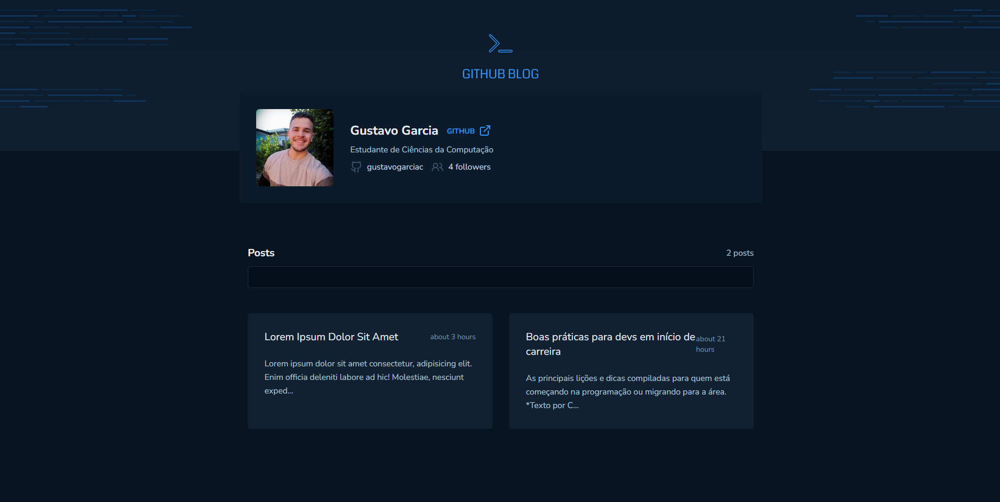

# Github-Blog - Front End

In this repository you can acess the frontend code of the GithubBlog project. It's a project that consists in a website that uses GitHub API to create a article-based blog.

## ✨ Live Preview

You can access the live preview clicking [here]().

## Preview



## 🚀 How can I set up the frontend?

First of all, clone the project in your computer.

```bash
  git clone git@github.com:gustavogarciac/github-blog.git
```

---

### 💫 Running the frontend

```bash
  // Install necessary dependencies
  $ npm install

  //Run the server
  $ npm run dev

  // The terminal will show you the write url to acess the server, otherwise you can acess
  // http://localhost:5173/

```

## 🚀 Technologies

- ReactJS
- Vite
- TailwindCSS
- Axios
- React Router Dom
- TypeScript
- Zod
- Date-FNS

## 💻 Copywright

Feel free to use this material to your own projects. Keep studying, we can change the world!
